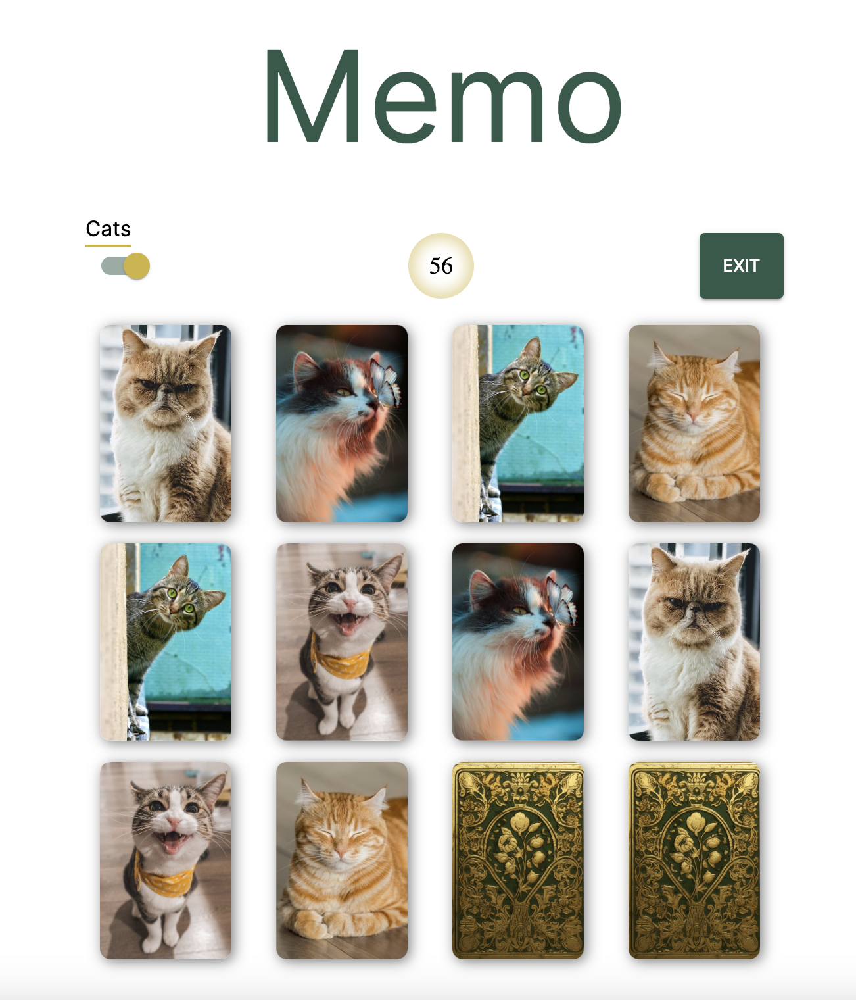

# Memo


## Обзор 
Memo - это игра для тренировки памяти, в которой вашей задачей является открыть парные карточки за минимальное количество попыток. Интерфейс адаптирован для любых устройств и разрешений экрана. 

## Сайт 
Вы можете поиграть прямо [сейчас] (https://memorium-card.netlify.app/).

## Технологии и библиотеки 
-React
-Material-UI

## Установка и запуск
Чтобы запустить проект локально:

1. Склонируйте репозиторий:

   ```
   git clone https://github.com/yourusername/memory-game.git
   ```
2. Перейдите в директорию проекта:

   ```
   cd memory-game
   ```
3. Установите зависимости:

   ```
   npm install
   ```
4. Запустите проект:

   ```
   npm start
   ```
5. Откройте [http://localhost:3000](http://localhost:3000) для просмотра в браузере.

## Планы на будущее

Собираюсь добавить следующие функции:

- **Рейтинговая система**: Пользователи смогут соревноваться за место в таблице лидеров.
- **Уровни сложности**: Будет добавлено несколько уровней сложности для улучшения игрового опыта.

## Контактная информация

Если у вас есть вопросы или предложения, пожалуйста, не стесняйтесь связаться со мной:

- **GitHub**: [AlexGusarov](https://github.com/AlexGusarov)
- **Telegram**: [@AGsrff](https://t.me/AGsrff)
  
